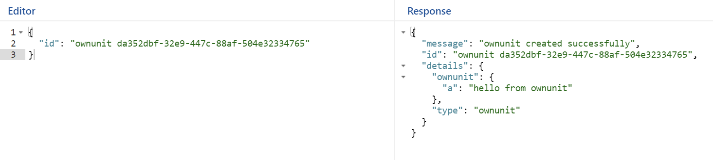
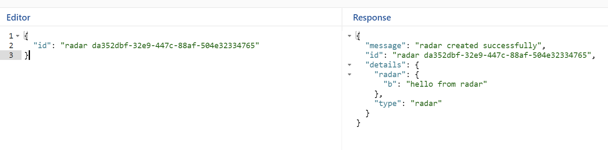
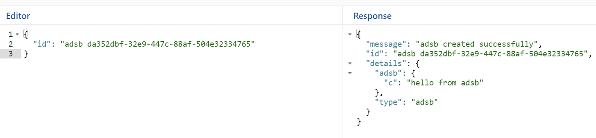

# spring-boot-grpc
Example gRPC usage with SpringBoot

based on https://blog.shiftasia.com/introduction-grpc-and-implement-with-spring-boot/

# How to make project from scratch

1. Follow https://blog.shiftasia.com/introduction-grpc-and-implement-with-spring-boot/ until `Generate server and client code`
2. We stop at `Generate server and client code` and will generate manually with `./gradlew generateProto`
3. Then continue follow the site again until `Spawn the gRPC server` and until you run the service
4. After running the gRPC Service, test it and see if its working

# references

- https://blog.shiftasia.com/introduction-grpc-and-implement-with-spring-boot/
- https://grpc-ecosystem.github.io/grpc-spring/
- https://github.com/grpc-ecosystem/grpc-spring

# Different response in one field (details field) example

### Ownunit Response

### Radar Response

### ADSB Response

